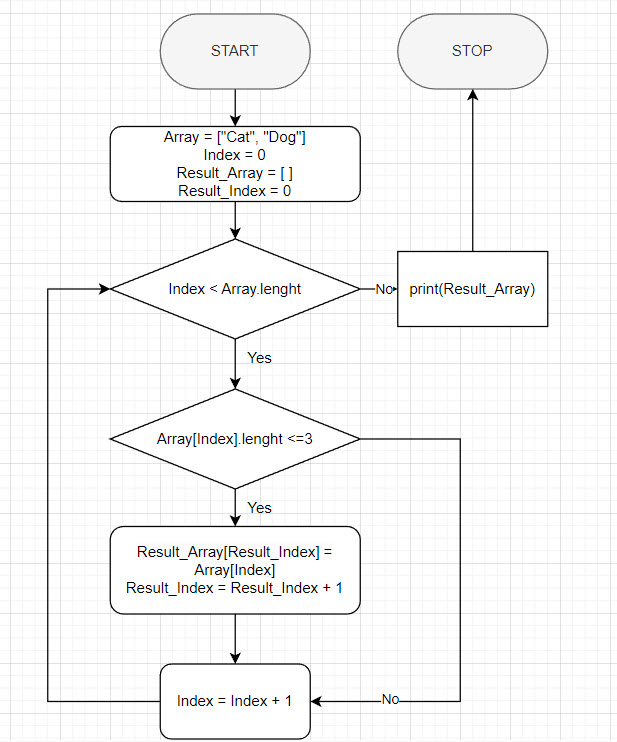

# Итоговая проверочная работа

## Текстовое описание решения

1. Дан массив строк. Объявим новый пустой массив с размером как у массива строк.
2. Если индекс массива < длины массива, то мы проверяем количество символов элемента с индексом массива, в противном случае переходим к шагу 6.
3. Если он меньше или равен 3, то этот элемент добавляется в новый пустой массив с индексом нового массива, увеличиваем его на 1 и переходим к следующему шагу. Если больше 3, то переходим к следующему шагу.
4. Увеличиваем индекс массива на 1.
5. Переходим к шагу 2.
6. Распечатывем новый массив.

## Блок-схема решения
